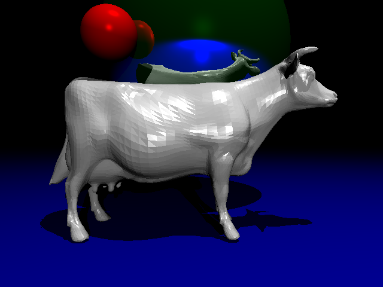
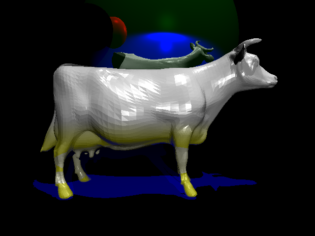

# ray-tracing-project
This is a ray-tracing project that I had to implement for my computer graphics class at the University of California, Riverside. We were given skeleton code of a ray-tracer and had to implement the functionality of the ray-tracer to allow it to properly render images. Since the project was not started from scratch, I had to go through the code base and understand what a lot of the code already did. What I implemented in this ray-tracer was the logic for phong shading and a lot of vector math for how light would reflect off of surfaces. I was able to walk away from this project with a better understanding of classes in C++ and a better ability to read code bases.
 
 
In this project, phong shading was used to apply the shading to our image subjects.

Expected Output:
 

My Output:
 

